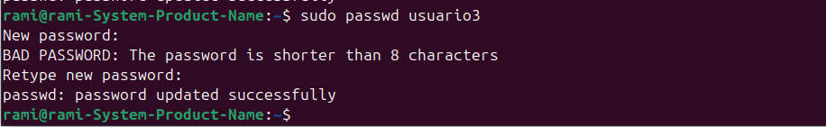
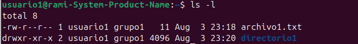

# Ramiro Agustin Telles Carcuz 202010044

## Actividad 3

Se creo Usuario 1

Se creo Usuario 2

Se creo Usuario 3

Se cambio de contraseña para Usuario1

Se cambio de contraseña para Usuario2

Se cambio de contraseña para Usuario3

id Usuario1

delete Usuario 3

crear grupos

cambiar usuario 1 de grupo

cambiar usuario 2 de grupo

comando groups para grupo1

comando groups para grupo2

Eliminar Grupo 2

Crear archivo 1

Crear Directorio1

Crear Archivo2

comando ls -l

comando ls -ld

Se cambian los permisos de archivo 1 de manera numérica

Se cambian permisos de manera simbólica

Se cambia grupo propietario

Se cambian Permisos del directorio

Se comprueban accesos

Verificar otra vez ls -l

Verificar otra vez ls -ld

---
### ¿Por qué es importante gestionar correctamente los usuarios y permisos en un sistema operativo?
- Para una mayor seguridad en el sistema

### ¿Qué otros comandos o técnicas conocen para gestionar permisos en Linux?
- ninguno más
